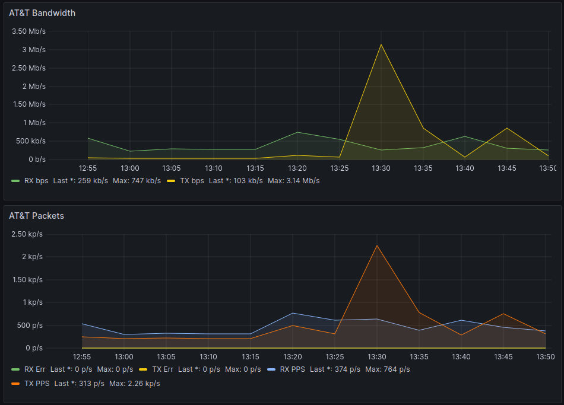

# AT&T U-Verse Router Bandwidth Scraper

## Purpose

Collect the WAN bandwidth metrics for the AT&T U-Verse Pace 5628AC home router.

Publish these metric to an InfluxDB V2 time series database.

Graph these metrics with Grafana to see how much bandwidth you're using on
average.



## Usage

1. Clone this repo into some directory on some server
2. Install the python requirements from requirements.txt
3. Copy example-config.toml to config.toml
4. Configure config.toml with your AT&T router and InfluxDB values
5. Configure cron to call get-att-bw.py every 5 minutes

## Recommended Cron Configuration

Cron needs absolute paths for things and I've referred to the config file with
a relative path. You can fix this with a `cd`. The following executes every 5
minutes and writes data to some temp file.

```crontab
*/5 * * * * cd /your/dir && python3 /your/dir/att-scraper/get-att-bw.py >>
/tmp/att-scraper.log
```

## Metrics Collected

From: `http://192.168.1.254/xslt?PAGE=C_1_0`
1. TX Packet Count
2. TX Byte Count
3. TX Packet Error Count
4. TX Packet Error %

5. RX Packet Count
6. RX Byte Count
7. RX Packet Error Count
8. RX Packet Error %

9. Time taken to complete request to router (total_time)
10. Python response.elapsed time (elapsed_time)

From: `http://192.168.1.254/xslt?PAGE=C_5_5`

10. NAT Connection Count (FUTURE)
11. NAT Connection % Used (FUTURE)

## Implementation

- Automate script run with cron
- Import configuration with TOML (because it's what's cool with kids these days)
- Scrape router HTML page (unathenticated) with requests
- Parse HTML and tables with BeautifulSoup (beautifulsoup4)
- Send data to InfluxDB 2 (Line Protocol because I'm too dumb to make JSON work)
- Graph results with Grafana

## Configurable Parameters

- Router IP
- InfluxDB IP
- InfluxDB Port (default 8086)
- InfluxDB Token
- InfluxDB Bucket
- InfluxDB Org
- InfluxDB Measurement Name (suggest net)
- InfluxDB Host Tag
- InfluxDB Region Tag (name of your house or location)

## Limitations
- ~Does not support modern InfluxDB versions~
    - ~Uses InfluxDB 1.8 client and tested on 1.8 database~
    - UPDATE 2023-12-31 - FIXED - Tested with Influx2 client and InfluxDB 2.4.7
- Only tested on Linux systems
- Close to zero error handling

## Example Grafana Queries

RX Bits Per Second
```
SELECT non_negative_derivative(mean("rx_bytes"), 1s) *8 FROM "net" WHERE ("host"::tag = 'router') AND $timeFilter GROUP BY time($__interval) fill(null)
```

TX Bits Per Second
```
SELECT non_negative_derivative(mean("tx_bytes"), 1s) *8 FROM "net" WHERE ("host"::tag = 'router') AND $timeFilter GROUP BY time($__interval) fill(null)
```

Will these queries handle counter wrapping? I don't know. They have
"non-negative derivative" and that's my attempt to deal with that. I don't know
what the math does when the counter wraps around.

I've found it's helpful to also graph the packets per second as an indicator
that you might have had a byte counter wrap. It's trivial in grafana to modify
the above to tx and rx_pkts and stop multiplying by 8, since you don't need to
convert from bytes to bits when you're counting packets.
